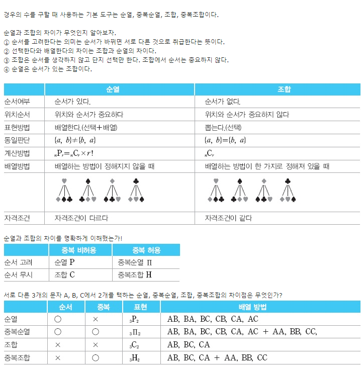

# [알고리즘] 순열, 중복순열, 조합, 중복조합 총정리

### 순열 - Permutation
```
nPr - 서로 다른 n개에서 r개를 뽑아서 정렬하는 경우의 수
```

※ 중요 포인트는 순서가 있다는 점

```java
public class AlgorithmStudy {
    public static void permutation(int[] arr, int[] out, boolean[] visited, int depth, int r){
        if(depth == r){
            for(int num: out) System.out.print(num);
            System.out.println();
            return;
        }
        for(int i=0; i<arr.length; i++){
            if(!visited[i]){
                visited[i] = true;
                out[depth] = arr[i];
                permutation(arr, out, visited, depth+1, r);
                visited[i] = false;
            }
        }
    }

    public static void main(String[] args){
        int[] arr = {1, 2, 3};
        int r = 2;
        permutation(arr, new int[r], new boolean[arr.length], 0, r);
    }
}
```
의견) 중복되지 않는 모든 경우의 수를 탐색한다고 생각하자.

### 중복 순열
```
nπr - 서로 다른 n개에서 *중복이 가능*하게 r개를 뽑아서 정렬하는 경우의 수
```
* 순서가 있게 뽑는 순열과 동일하지만, 같은 원소를 **중복**해서 뽑을수 있는 차이

```java
public class AlgorithmStudy {
    public static void permutation(int[] arr, int[] out, int depth, int r){
        if(depth == r){
            for(int num: out) System.out.print(num);
            System.out.println();
            return;
        }
        for(int i=0; i<arr.length; i++){
            out[depth] = arr[i];
            permutation(arr, out, depth+1, r);
        }
    }

    public static void main(String[] args){
        int[] arr = {1, 2, 3};
        int r = 2;
        permutation(arr, new int[r], 0, r);
    }
}
```
의견) (순열 - visited 변수)로 생각하면 된다.


### 조합 - Combination
```
nCr - 서로 다른 n개에서 순서 없이 r개를 뽑는 경우의 수
```
* 즉 같은 경우의 수인 AB, BA를 같은 경로 본다는 점

```java
public class AlgorithmStudy {
    public static void combination(int[] arr, boolean[] visited, int start, int depth, int r){
        if(depth == r){
            for(int i=0; i<arr.length; i++){
                if(visited[i]) System.out.print(arr[i]);
            }
            System.out.println();
            return;
        }
        for(int i=start; i<arr.length; i++){
            if(!visited[i]){
                visited[i] = true;
                combination(arr, visited, i+1, depth+1, r);
                visited[i] = false;
            }
        }
    }

    public static void main(String[] args){
        int[] arr = {1, 2, 3};
        int r = 2;
        combination(arr, new boolean[arr.length], 0, 0, r);
    }
}
```

* 순서 상관없이 조회하기 위해서는 현재 선택한 원소보다 뒤에 있는 원소만 탐색해야한다.
* 탐색 시작인 index 변수를 start 원소를 만들어 사용하자.
* 재귀를 호출할때는 현재 index + 1을 더한 값을 넣어준다.

의견) 순열과 조합의 차이는 '순서' 이기 때문에 현재 상태 결과값을 다음 재귀에 넣어주냐의 차이


### 중복조합
```
nHr - 서로 다른 n개에서 순서 없이, 중복이 가능하게 r개를 뽑는 경우의 수
```
* 조합 + 중복 허용

```java
public class AlgorithmStudy {
    public static void combination(int[] arr, int[] out, int start, int depth, int r){
        if(depth == r){
            for(int num : out) System.out.print(num);
            System.out.println();
            return;
        }
        for(int i=start; i<arr.length; i++){
            out[depth] = arr[i];
            combination(arr, out, i, depth+1, r);
        }
    }

    public static void main(String[] args){
        int[] arr = {1, 2, 3};
        int r = 2;
        combination(arr, new int[r], 0, 0, r);
    }
}
```


* 추가로 수학적 자료 첨부


